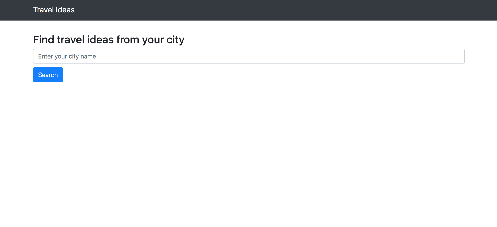
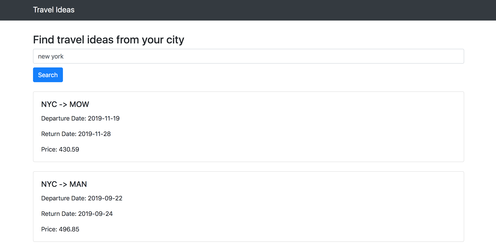

# Travel Ideas
Travel Ideas app generates random travel ideas based on your current city


## Screenshots

### Homepage


### Search Results



## Getting Started

1) Clone Repo
    ```
    $ git clone https://github.com/viraja1/travel_ideas.git
    ```
2) Change directory
    ```
    $ cd travel_ideas
    ```

3) Install Requirements
    ```
    $ pip install -r requirements.txt
    ```

4) Get Amadeus api key and api secret
   ```
   https://developers.amadeus.com
   ```
   
5) Create .env file with Amadeus api key and api secret
   ```
   touch .env 
   ```
   
   File content
   ```
   AMADEUS_API_KEY=ACTUAL_API_KEY
   AMADEUS_API_SECRET=ACTUAL_API_SECRET
   ```  

5) Run Server
   ```
   $ python app.py
   ``` 
5) Open http://127.0.0.1:8080 in browser and use the UI to test Travel Ideas